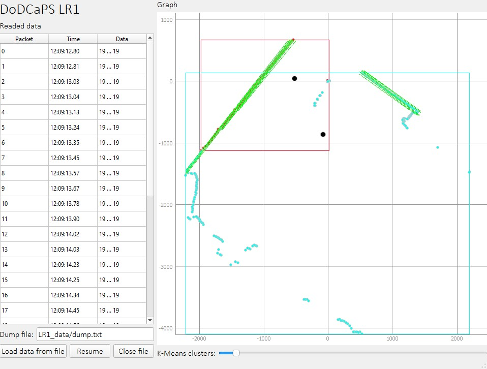

# Разработка систем сбора и обработки данных. Лабораторно-практическое задание № 1
## Python. Полностью свободное использование



### Задание:

```
Лабораторно-практическое задание № 1
Тема: Обработка линейно структурированных данных.
Цель работы: Разработать алгоритм считывания и визуализации потоковых данных с
плоскостного 2D-лидара
Задачи:
 Подготовить приложение считывания данных плоскостного лидара, сохраненных в
потоковом формате;
 Разработать функцию покадровой визуализации данных фреймов лидара;
 Разработать функцию детектирования объектов методом кластерного анализа;
 Разработать метод отслеживания траекторий объектов между фреймами;
Порядок выполнения работы
Задача 1
Подготовить приложение для считывания данных из файла, хранящего поток данных с
плоскостного лидара. Представить возможность просмотра данных в текстовом виде как в
непрерывном виде (отображается покадрово в соответствии с временными отметками) с
возможностью поставить чтение «на паузу» (будет отображаться один фрейм).
Задача 2
Подготовить систему визуализации данных лидара в виде круговой диаграммы
(данные приходят в мм). Использовать небольшие квадраты или окружности для
отображения позиций препятствий (концов лучей).
Задача 3
Разработать функцию поиска центров масс кластеров методом k-means и отсечения
линейных объектов (стен) за счет разбиения на блоки с настраиваемым количеством
точек. Выполнить обводку прямоугольниками найденных объектов.
Детектирование линейных объектов выполняется путем поиска цепочек объектов,
выстроенных в одну линию.
Задача 4
Для отдельных объектов и краевых объектов (концов стен) выполнить поиск
перемещения объектов между кадрами. Отрисовывать траектории движения центров
объектов поверх изображения текущего кадра. Координаты центров хранить в списках и
выводить в структурированном виде в listbox.
```
